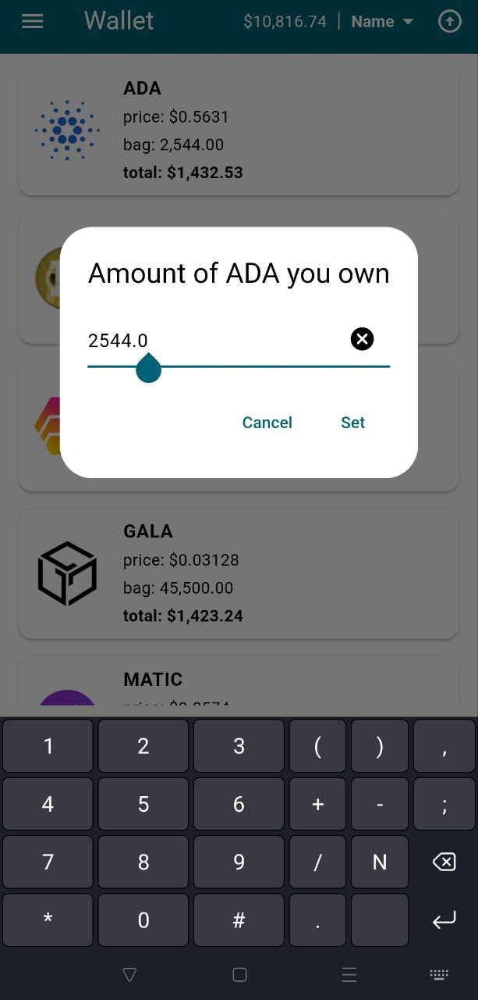

# Crypto Checker

"Crypto Checker" is a versatile Flutter application designed for cryptocurrency enthusiasts and investors. It features three distinct views, catering to various aspects of crypto asset management and monitoring.

**Portfolio Monitoring View** 

This central view showcases a predefined list of cryptocurrencies (tokens/coins). Users can personalize their experience by adjusting the visibility of each token in the list, aligning with their investment preferences. Additionally, for each cryptocurrency, users have the option to input and track the specific amount they own, enabling a tailored and informative portfolio overview.

**Visibility Management Screen**

A dedicated interface allows users to efficiently manage the visibility of their cryptocurrency holdings. This functionality is particularly useful for focusing on specific assets in their portfolio, enabling users to streamline their monitoring process by hiding or revealing various tokens as desired.

**Financial Planning Screen**

This feature-rich screen is designed for users to strategize their investment goals and obligations. It includes tools to specify the percentage of their total cryptocurrency worth they plan to reinvest. Furthermore, users can input their local taxation rates to calculate and understand the net gains from their investments. The application enhances this experience by offering the convenience of displaying net gains in multiple major currencies, including dollars, euros, and sterling, providing a global perspective on investment returns.

**Overall**

The app serves as a comprehensive tool for crypto asset management, offering visibility customization, investment tracking, and financial planning capabilities, all within a user-friendly mobile application.

**Screenshots**

  <table>
  <tr>
    <td>
      
Wallet list

      
    </td>
    <td>
      
Order by

      
    </td>
    <td>
      
Hiding token

      
    </td>
  </tr>
  <tr>
    <td>
      
Bag amount setting dialog

      
    </td>
    <td>
      
Drawer

      
    </td>
    <td>
      
Token visibility list

      
    </td>
  </tr>
  <tr>
    <td>
      
Financial settings

      
    </td>
    <td></td>
    <td></td>
  </tr>
</table>

**Build**

flutter build apk --split-per-abi